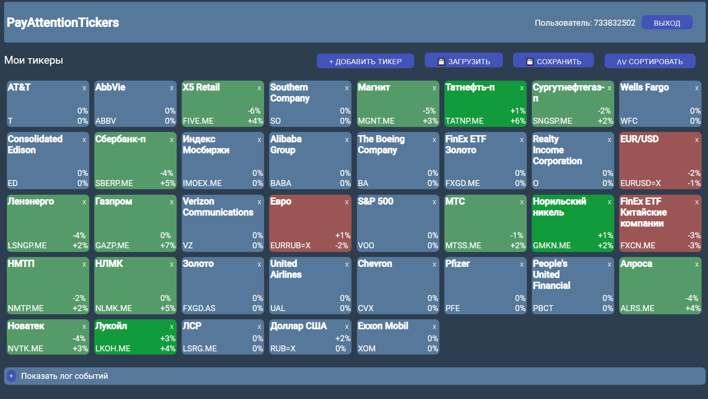

# PayAttentionTickers

Веб-сервис для отслеживания отклонений котировок ценных бумаг от среднемесячных и средних за неделю значений с оповещением через Телеграм-бота. 

Backend:
В версии 1.0 построен на Flask/PostgeSQL(psycopg2), бот для Телеграм с использованием Telebot.
В версии 2.0 переписан на Aiohttp/PostgeSQL(sqlalchemy)/Redis(aioredis для кэширования), бот для Телеграм с использованием aiogram.
Для работы с биржей и построения графиков используются модули yahoo_fin и matplotlib, импорт/экспорт списка тикеров в Excel использует модуль openpyxl.

Frontend: 
Используется Vue.js/Vuex.

